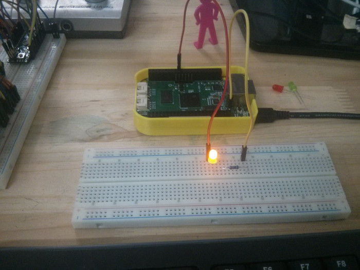

#bb blink

##Circuit
P9_27		------		LED+
P9_45		------		resistor
resistor	------		LED-

use 220oh resistor



##Clone and compile the code
```
source <SDK_PATH>/linux-devkit/environment-setup
git clone https://github.com/lvyuanjiao/bb_blink
cd bb_blink
git clone https://github.com/beagleboard/am335x_pru_package
make
```

##Upload to target
```
scp ./bb_blink ./bb_blink.bin ./BB-BLINK.dts root@beaglebone.local:/root/
```

##Execution
```
ssh root@beaglebone.local
dtc -O dtb -o BB-BLINK-00A0.dtbo -b 0 -@ ./BB-BLINK.dts
cp ./BB-BLINK-00A0.dtbo /lib/firmware/
echo BB-BLINK > /sys/devices/bone_capemgr.*/slots
./bb_blink
```
